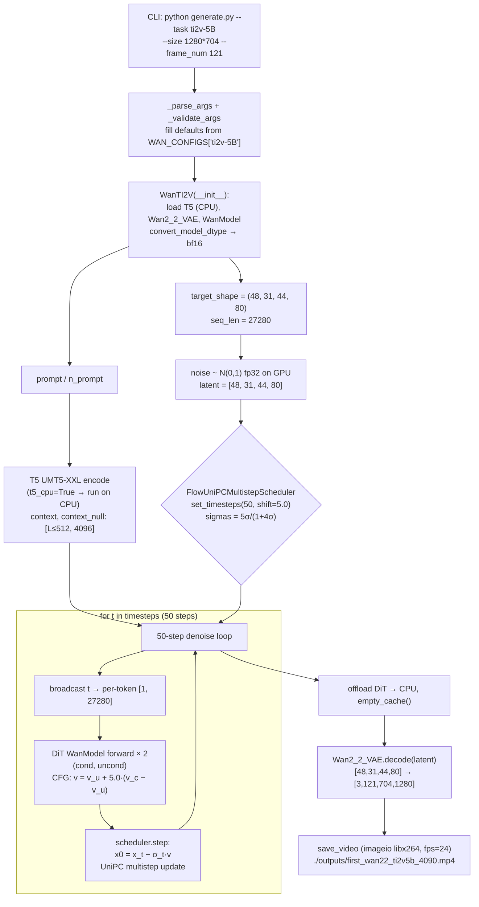

# Wan2.2-TI2V-5B Code Walkthrough

从命令行 `python generate.py --task ti2v-5B ...` 一路读到 mp4 落盘，覆盖
**参数解析 → 配置装配 → T5 编码 → Flow-Matching 采样 → DiT 前向 → VAE 解码 → save_video**。
所有引用都指向本次实验使用的官方仓库
（`Wan2.2/` 相对本 runbook 上一级目录）。

代入本次实验：`--size 1280*704 --frame_num 121 --task ti2v-5B`（默认 sample_steps=50，
guide_scale=5.0，sample_shift=5.0，sample_fps=24），下文中所有形状均为真实取值。

---

## 1. `generate.py` — 入口与参数分发

`_parse_args()` 用 argparse 定义了统一入口，`--task` 的 choices 来自
`WAN_CONFIGS.keys()`（`generate.py:117-122`）。5B 相关关键项：

| flag | 默认/来源 | 说明 |
|---|---|---|
| `--task` | `t2v-A14B` | 我们传 `ti2v-5B` |
| `--size` | `1280*720` | 5B 仅允许 `1280*704 / 704*1280`（`configs/__init__.py:45`） |
| `--frame_num` | None → cfg=121 | 需满足 `4n+1`（VAE 时序压缩 4×，首帧独立） |
| `--offload_model` | None → world_size==1 时置 True | 分阶段把 DiT/T5 迁回 CPU |
| `--convert_model_dtype` | False | 把 DiT 权重转 `cfg.param_dtype=bf16` |
| `--t5_cpu` | False | T5 UMT5-XXL 全程 CPU（省 ~10GB 显存） |
| `--sample_steps` / `--sample_shift` / `--sample_guide_scale` | 由 cfg 填 50/5.0/5.0 | 见 §6 |

`_validate_args()`（`generate.py:87-102`）从 `WAN_CONFIGS[args.task]` 补默认。
`generate()` 的 task 分发：

```python
elif "ti2v" in args.task:                                       # generate.py:428
    wan_ti2v = wan.WanTI2V(config=cfg, checkpoint_dir=args.ckpt_dir,
                           t5_cpu=args.t5_cpu,
                           convert_model_dtype=args.convert_model_dtype, ...)  # :430-440
    video = wan_ti2v.generate(args.prompt, img=img,
                              size=SIZE_CONFIGS[args.size],
                              frame_num=args.frame_num,
                              shift=args.sample_shift,
                              sample_solver=args.sample_solver,      # 'unipc' 默认
                              sampling_steps=args.sample_steps,
                              guide_scale=args.sample_guide_scale,
                              seed=args.base_seed,
                              offload_model=args.offload_model)      # :443-454
```

若未传 `--image`（本次实验没传），`WanTI2V.generate` 内部走 `t2v()` 分支。

结尾（rank==0）：

```python
save_video(tensor=video[None], save_file=args.save_file,
           fps=cfg.sample_fps, nrow=1,
           normalize=True, value_range=(-1, 1))                # :531-537
```

---

## 2. 关键配置 `wan/configs/wan_ti2v_5B.py`

```
t5_checkpoint     = 'models_t5_umt5-xxl-enc-bf16.pth'   # :12
t5_tokenizer      = 'google/umt5-xxl'                   # :13
vae_checkpoint    = 'Wan2.2_VAE.pth'                    # :16   <-- VAE 2.2 (z_dim=48)
vae_stride        = (4, 16, 16)                         # :17   (T, H, W)
patch_size        = (1, 2, 2)                           # :20   DiT 3D patch
dim               = 3072                                # :21
ffn_dim           = 14336                               # :22
num_heads         = 24                                  # :24
num_layers        = 30                                  # :25
sample_fps        = 24                                  # :32
sample_shift      = 5.0                                 # :33
sample_steps      = 50                                  # :34
sample_guide_scale= 5.0                                 # :35   (标量，A14B 是 tuple)
frame_num         = 121                                 # :36
```

`shared_config.py` 补充：`t5_dtype=bf16, text_len=512, param_dtype=bf16,
num_train_timesteps=1000`（`:10-17`）。

与 A14B 系列的主要差异：
- **VAE**：`Wan2_2_VAE`（z_dim=48，空间 16× 时序 4×），而 A14B 是 `Wan2_1_VAE`（z_dim=16，空间 8×）。
- **单专家**：5B 单一 DiT ckpt；A14B 有 `low_noise_checkpoint`/`high_noise_checkpoint` 两个专家 + `boundary`。
- **guide_scale**：5B 标量 5.0；A14B 是 `(low, high)` tuple。
- 5B `sample_fps=24`（对应 121 帧≈5s）；A14B 默认 16fps。

---

## 3. `wan/textimage2video.py` — WanTI2V pipeline

### 3.1 构造 (`__init__`, `:35-114`)

```python
self.text_encoder = T5EncoderModel(text_len=512, dtype=bf16,
                                   device='cpu',
                                   checkpoint_path=".../models_t5_umt5-xxl-enc-bf16.pth",
                                   tokenizer_path=".../google/umt5-xxl")       # :86-92
self.vae   = Wan2_2_VAE(vae_pth=".../Wan2.2_VAE.pth", device=self.device)      # :96-98
self.model = WanModel.from_pretrained(ckpt_dir)                                # :101 (DiT 主干)
self.model = self._configure_model(...)                                        # :102-107
```

`_configure_model`（`:116-155`）：`eval() + requires_grad_(False)`；若
`convert_model_dtype=True`，`model.to(bfloat16)`；若 `init_on_cpu=True`（单卡默认），
DiT 先常驻 CPU，采样前再 `to(device)`。

### 3.2 t2v 完整流程（`:234-403`）

**(a) 目标 latent 形状**（`:298-303`）：

```python
target_shape = (self.vae.model.z_dim,                    # 48
                (F - 1) // vae_stride[0] + 1,            # (121-1)//4 + 1 = 31
                 size[1] // vae_stride[1],               # 704 //16 = 44
                 size[0] // vae_stride[2])               # 1280//16 = 80
seq_len = ceil(target_shape[2]*target_shape[3]
               / (patch_size[1]*patch_size[2])
               * target_shape[1] / sp_size) * sp_size    # 44*80/(2*2)*31 = 27280
```

→ **latent = `[48, 31, 44, 80]`；DiT token 数 = 27280；hidden dim = 3072。**

**(b) T5 编码 + t5_cpu 分支**（`:313-323`）：

```python
if not self.t5_cpu:
    self.text_encoder.model.to(self.device)
    context      = self.text_encoder([input_prompt], self.device)
    context_null = self.text_encoder([n_prompt],     self.device)
    if offload_model: self.text_encoder.model.cpu()
else:                                              # 我们跑的路径
    context      = self.text_encoder([input_prompt], torch.device('cpu'))
    context_null = self.text_encoder([n_prompt],     torch.device('cpu'))
    context      = [t.to(self.device) for t in context]
    context_null = [t.to(self.device) for t in context_null]
```

**(c) 初始高斯噪声**（`:325-334`）：
```python
noise = [torch.randn(48, 31, 44, 80, dtype=fp32, device=self.device, generator=seed_g)]
```

**(d) Scheduler**（`:352-367`）：
```python
sample_scheduler = FlowUniPCMultistepScheduler(
    num_train_timesteps=1000, shift=1, use_dynamic_shifting=False)
sample_scheduler.set_timesteps(sampling_steps=50, device=device, shift=5.0)
timesteps = sample_scheduler.timesteps          # 50 个 flow-matching 时间步
```

**(e) DiT + CFG 去噪循环**（`:369-393`）：

```python
if offload_model or self.init_on_cpu:
    self.model.to(self.device)                              # <-- 关键：临上场再迁 GPU
    torch.cuda.empty_cache()

for t in tqdm(timesteps):                                   # 50 步
    # 把标量 t 广播成 [1, seq_len] 的 per-token timestep
    temp_ts = (mask2[0][0][:, ::2, ::2] * t).flatten()
    temp_ts = torch.cat([temp_ts,
                         temp_ts.new_ones(seq_len - temp_ts.size(0)) * t])
    timestep = temp_ts.unsqueeze(0)                         # [1, 27280]

    v_cond   = self.model(latents, t=timestep, context=context,      seq_len=seq_len)[0]
    v_uncond = self.model(latents, t=timestep, context=context_null, seq_len=seq_len)[0]
    v        = v_uncond + guide_scale * (v_cond - v_uncond)          # CFG=5.0

    latents  = [sample_scheduler.step(v.unsqueeze(0), t,
                                      latents[0].unsqueeze(0),
                                      return_dict=False,
                                      generator=seed_g)[0].squeeze(0)]
```

**(f) VAE decode + 卸载**（`:395-401`）：
```python
if offload_model:
    self.model.cpu(); torch.cuda.synchronize(); torch.cuda.empty_cache()
if self.rank == 0:
    videos = self.vae.decode(x0)          # -> [Tensor([3, 121, 704, 1280])], clamp [-1,1]
```

`--offload_model True` 的完整语义：
- T5 编码前后：GPU ⇄ CPU（`:314, 317`）
- DiT 上场前 `to(device)`，跑完 `cpu()`（`:349, 396`）
- 每次卸载后 `torch.cuda.empty_cache() + gc.collect()`（`:399, 407-408`）

`--convert_model_dtype` 的语义：`WanModel.to(config.param_dtype=bf16)`
（`textimage2video.py:151-152`）——权重占用直接砍半，配合 bf16 autocast（`:344`）。

---

## 4. `wan/modules/model.py` — WanModel (DiT)

**构造**（`WanModel.__init__`, `:308-405`）：

```python
self.patch_embedding = nn.Conv3d(in_dim, dim, kernel_size=patch_size,
                                 stride=patch_size)                         # :388
self.text_embedding  = nn.Sequential(Linear(text_dim=4096, dim),
                                     GELU, Linear(dim, dim))                # :389-391
self.time_embedding  = nn.Sequential(Linear(freq_dim, dim), SiLU,
                                     Linear(dim, dim))                      # :393-394
self.time_projection = nn.Sequential(SiLU, Linear(dim, dim*6))              # :395
self.blocks = nn.ModuleList([WanAttentionBlock(...)                         # :398-401
                             for _ in range(num_layers=30)])
self.head   = Head(dim, out_dim, patch_size)                                # :404
```

**forward**（`:432-517`）关键片段（每一步 latent → v_pred）：

```python
x = [self.patch_embedding(u.unsqueeze(0)) for u in x]
                # [1, 3072, F_p=31, H_p=22, W_p=40]         (H/2, W/2)
grid_sizes = [[31, 22, 40]]
x = [u.flatten(2).transpose(1, 2) for u in x]              # [1, 27280, 3072]
x = pad_to(seq_len=27280)

# per-token timestep -> 6-way AdaLN modulation
e  = self.time_embedding(sinusoidal_embedding_1d(...))     # [B, seq_len, dim]
e0 = self.time_projection(e).unflatten(2, (6, dim))        # [B, seq_len, 6, dim]

context = self.text_embedding(pad_to(text_len=512))        # [1, 512, 3072]

for block in self.blocks:                                  # 30 blocks
    x = block(x, e=e0, context=context, ...)
x = self.head(x, e)                                        # -> [1, 27280, 1*2*2*48=192]
x = self.unpatchify(x, grid_sizes)                         # -> [48, 31, 44, 80]
```

`WanAttentionBlock`（`:174-238`）内部执行：AdaLN 调制 → **Self-Attn (3D RoPE, flash-attn)** →
**Cross-Attn to text** → FFN（Linear-GELU(tanh)-Linear）。

> **模型输出物理意义**：flow-matching velocity `v = ε − x0`（见 §6）。

---

## 5. `wan/modules/vae2_2.py` — Wan2_2_VAE

**压缩比来源**：
- 空间 16× ＝ 外层 `patchify(x, patch_size=2)` 的 2× + `dim_mult=[1,2,4,4]` 三段 stride-2 = 8×，合 **16×**。
- 时序 4× ＝ `temperal_downsample=[False, True, True]` 两次时序 stride-2 = **4×**。
- `z_dim=48`（`vae2_2.py:892`），配套 48-维 `mean/std` 归一化。

**接口**：

```python
class Wan2_2_VAE:
    def __init__(self, z_dim=48, dim_mult=[1,2,4,4],
                 temperal_downsample=[False, True, True],
                 vae_pth=..., device='cuda'):                          # :890-1022
        self.scale = [mean, 1.0 / std]                                 # per-channel

    def encode(self, videos):    # List[[3, F, H, W]] -> List[[48, F_lat, H/16, W/16]]
    def decode(self, zs):        # List[[48, F_lat, H/16, W/16]] -> List[[3, F, H, W]] in [-1,1]
```

`AutoencoderKLWan2_2.encode/decode`（`:783-838`）采用**时间因果分块**（chunk=4，滑窗 feature cache）
逐段处理长视频，避免一次性占用大显存。

---

## 6. `wan/utils/fm_solvers_unipc.py` — Flow-Matching (UniPC)

**timestep schedule**（`set_timesteps`, `:162-213`）：

```python
sigmas = np.linspace(sigma_max, sigma_min, num_inference_steps + 1)[:-1]  # 均匀
if not use_dynamic_shifting:                            # 5B 走此分支
    sigmas = shift * sigmas / (1 + (shift - 1) * sigmas)   # <-- sample_shift=5.0
timesteps = sigmas * num_train_timesteps                    # σ∈[0,1] → t∈[0,1000]
```

`shift>1` 把 σ 曲线整体推向 1（噪声大的区间多花步数，更利于高分辨率生成）。

**flow-matching velocity → x0**（`:320-332`）：

```python
if self.predict_x0 and self.config.prediction_type == "flow_prediction":
    sigma_t = self.sigmas[self.step_index]
    x0_pred = sample - sigma_t * model_output               # v = ε - x0
```

**`step()`**（`:657+`）用多步 UniPC 预测-校正：先转 `x0_pred`，再
`multistep_uni_p_bh_update` (预测) + `multistep_uni_c_bh_update` (校正)。1 阶时等价于
`x_{t-1} = x_t + (σ_{t-1} − σ_t) · v_θ(x_t)`；高阶用历史 model output 做 Adams 型插值。

---

## 7. `wan/utils/utils.py` — save_video

`save_video` (`:90-120`)：

```python
tensor = tensor.clamp(-1, 1)
tensor = torch.stack([
    torchvision.utils.make_grid(u, nrow=1, normalize=True, value_range=(-1,1))
    for u in tensor.unbind(2)                     # 沿 frame 维展开
], dim=1).permute(1, 2, 3, 0)                     # -> [F, H, W, 3]
tensor = (tensor * 255).type(torch.uint8).cpu()

writer = imageio.get_writer(cache_file, fps=fps, codec='libx264', quality=8)
for frame in tensor.numpy():
    writer.append_data(frame)
writer.close()
```

`fps` 直接取 `cfg.sample_fps=24`；后端是 `imageio-ffmpeg`（libx264）。

---

## 8. 完整数据流 Pseudo-code（本次实验代入值）

```python
# ---- generate.py ----
cfg  = WAN_CONFIGS['ti2v-5B']                        # frame_num=121, steps=50, cfg=5.0, shift=5.0
pipe = WanTI2V(cfg, ckpt_dir='./Wan2.2-TI2V-5B',
               t5_cpu=True, convert_model_dtype=True)
    # text_encoder = T5(UMT5-XXL, bf16, CPU-resident)
    # vae          = Wan2_2_VAE(z_dim=48, stride=(4,16,16))
    # dit          = WanModel(dim=3072, 30 blocks, bf16)  <-- init on CPU

video = pipe.generate(prompt, img=None,
                     size=(1280,704), frame_num=121,
                     sample_solver='unipc', sampling_steps=50,
                     shift=5.0, guide_scale=5.0, offload_model=True)
    # ---- t2v() ----
    target_shape = (48, 31, 44, 80)                      # latent
    seq_len      = 27280                                 # DiT tokens

    # T5 (CPU): prompt / n_prompt -> context, context_null  ([L,4096]) -> .to(cuda)
    noise  = randn(48, 31, 44, 80, fp32, device='cuda')

    sched  = FlowUniPCMultistepScheduler(num_train_ts=1000, shift=1)
    sched.set_timesteps(50, device='cuda', shift=5.0)    # sigmas=5σ/(1+4σ), t=σ*1000

    dit.to('cuda')
    for t in sched.timesteps:                            # 50 iters
        per_tok_t = broadcast(t, [1, 27280])
        v_c = dit(latents, t=per_tok_t, context=context     )      # velocity
        v_u = dit(latents, t=per_tok_t, context=context_null)
        v   = v_u + 5.0 * (v_c - v_u)                    # CFG
        latents = sched.step(v, t, latents)              # x0_pred = x_t - σ_t·v, UniPC 更新
    dit.cpu(); empty_cache()

    frames = vae.decode(latents)                         # -> [3, 121, 704, 1280] in [-1,1]

# ---- back to generate.py ----
save_video(frames[None], save_file, fps=24, normalize=True, value_range=(-1,1))
# torchvision.make_grid per-frame -> uint8 -> imageio libx264 mp4
```

---

## 9. 关键张量形状速查

| 位置 | 张量 | 形状 |
|---|---|---|
| VAE encode 输入 / decode 输出 | RGB | `[3, 121, 704, 1280]`，`[-1, 1]` |
| VAE latent | z | `[48, 31, 44, 80]` |
| DiT patchify grid | grid_sizes | `[31, 22, 40]` |
| DiT token 序列 | x | `[1, 27280, 3072]` |
| Text context (T5) | context | `[≤512, 4096]` → embed 后 `[1, 512, 3072]` |
| Time modulation | e0 | `[1, 27280, 6, 3072]` |
| DiT 输出 | velocity v | `[48, 31, 44, 80]` |

数值确认：`(121-1)/4+1 = 31`；`704/16 = 44`；`1280/16 = 80`；`44·80/(2·2)·31 = 27280`。

---

## 10. Mermaid 数据流图



---

## 11. 两条隐含约束

1. `frame_num` 必须满足 `4n+1`（VAE 时序压缩 4×，且首帧因果独立）。默认 121 = 4·30+1。
2. `size` 必须被 `vae_stride[1]·patch_size[1] = 32` 整除；`SUPPORTED_SIZES['ti2v-5B']`
   仅列出 `1280*704` 与 `704*1280`（`configs/__init__.py:45`）。
